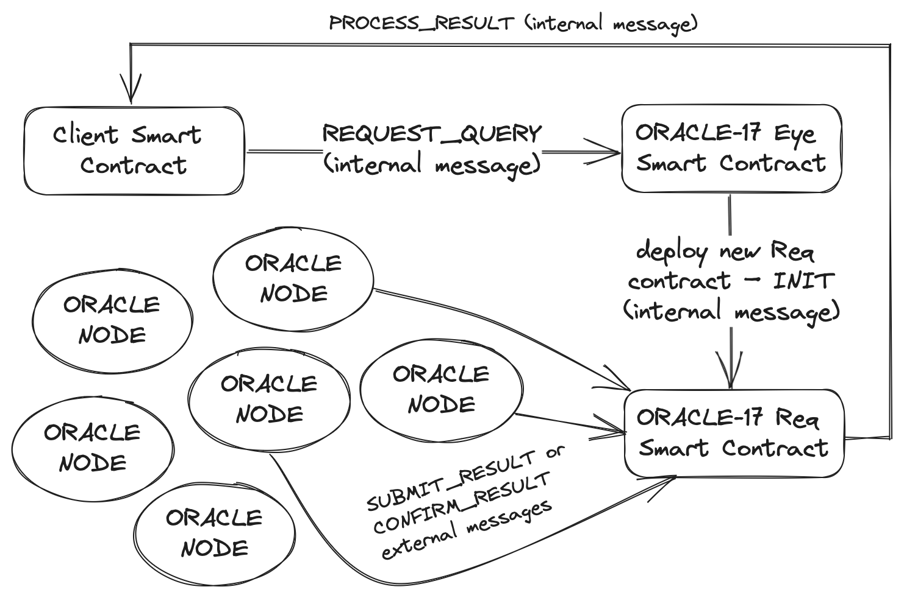

# ORACLE-17.0

ORACLE-17 proof of concept monorepo

ORACLE-17 is a decentralized oracle system based on the Venom Blockchain,
enabling efficient and secure retrieval of external world data by smart
contracts. This project is designed to provide a reliable and trustworthy
data source to enable the execution of complex smart contract applications
and automate blockchain-based transactions. The ORACLE-17 ecosystem is
powered by a network of oracle nodes that validate and verify data.



### Venom Blockchain devnet Eye address
```
0:1a5ddb05c7f7abc492d2733cdd8adedab90ea9e2152243d0516ac5d86d3d1fcb
```

### Example usage

See the [`./example/`](./example/) directory as an example of how to use the
ORACLE-17 system. This example shows a smart contract that communicates with
the outside world by sending an HTTP requests through the ORACLE-17 system.

### Monorepo structure

- [`./contracts/`](./contracts/) – TVM Smart Contracts
- [`./oracle-swift/`](./oracle-swift/) – oracle node and cli tool
- [`./example/`](./oracle-swift/) – example usage of the system
- [`./Test/`](./Test/) – oracle-17 setup testnet scripts

# Build oracle node and cli

### Prerequirements
```
swift-driver version 1.75.2 or newer
Apple Swift version 5.8.1 or newer
```

### Build from src

1. `cd oracle-swift`
2. `swift build`

# Setup contracts (dev)

### Prerequirements

```
Python 3.9.6 or newer
Fift TON v2023.05 or newer
TON Solidity Compiler =0.69.0
GNU bash, version 3.2.57 or newer
t2f =0.1.8 (pypi.org/project/t2f/)
```

### Build contracts

1. go to the directory `cd contracts`
2. run build bash script `bash build.sh`

### Deploy eye contract

1. `fift -s fift/init-eye.fif ./build/eye`
2. send init, body to the address from the output

## License

`Apache-2.0`

